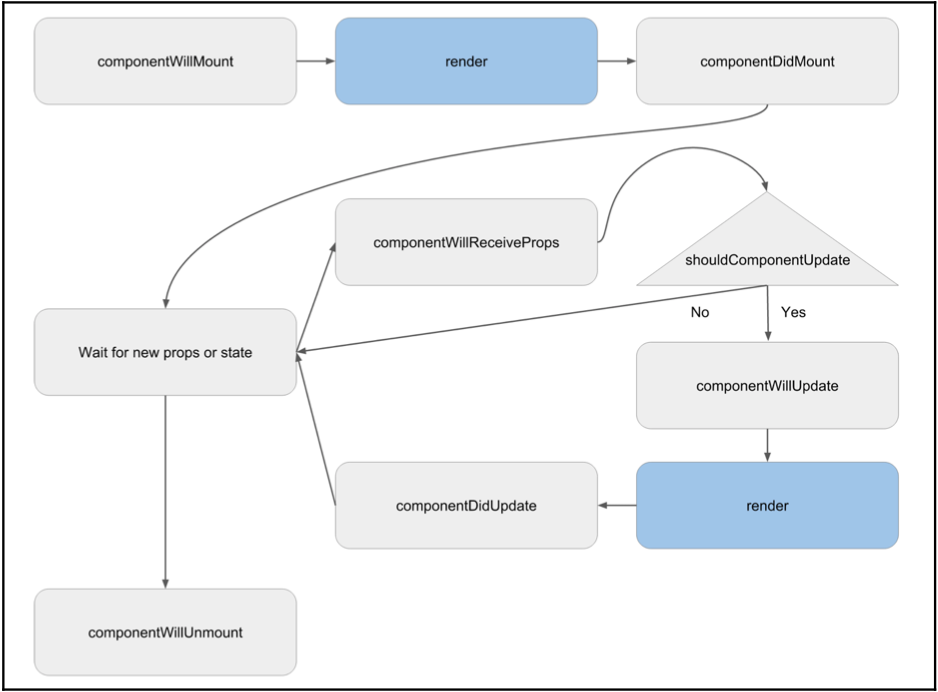

# React Research

**React Lifecycle**

`Life Cycle`

**PureComponent and Component**

When state changed although data changed or not, component will re-render.
But PureComponent not re-render if data still not changed.

**Presentational and Container Components**

[Link source](https://medium.com/@dan_abramov/smart-and-dumb-components-7ca2f9a7c7d0)

|   | Presentational | Container |
| ------------- |:-------------:| -----:|
| Concerned with  | how things look  | how things work  |
| May contain both `presentational` and `container` components ** inside | usually `have` some DOM markup and styles of their own.  | usually `don’t have` any DOM markup of their own except for some wrapping divs, and never have any `styles`.  |
|   | Often allow containment via `this.props.children`.  | Provide the data and behavior **to presentational or other container components**.  |
| Actions?  | Have *no dependencies* on the rest of the app, such as `Flux actions` or `stores`.  | *Call* `Flux actions` and provide these as callbacks to the presentational components.  |
|   | Don’t specify how the data is *loaded or mutated*. Receive data and callbacks exclusively via `props`. Rarely have their **own state** (when they do, it’s *UI state* rather than *data*).  | Are often *stateful*, as they tend to serve as data sources.  |
|   | Are written as **functional components** unless they need state, **lifecycle hooks**, or **performance optimizations**.  | Are usually generated using higher order components such as *connect()* from `React Redux`, *createContainer()* from `Relay`, or *Container.create()* from `Flux Utils`, rather than written by **hand**.  |
| **Examples**  | Page, Sidebar, Story, UserInfo, List. | UserPage, FollowersSidebar, StoryContainer, FollowedUserList.  |